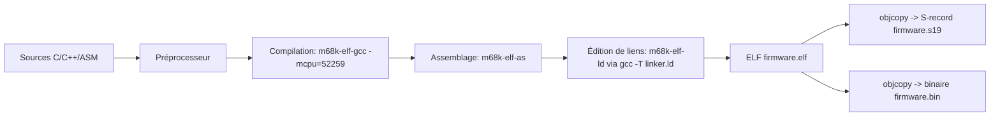
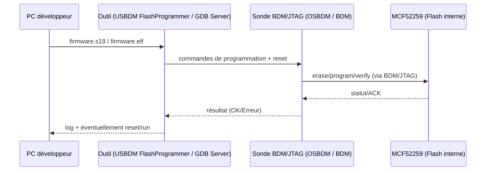

# Alternatives à CodeWarrior pour compiler et modifier un firmware ColdFire V2 MCF52259 sans licence

## Résumé exécutif

Le entity["company","NXP Semiconductors","semiconductor company"] MCF52259 (cœur ColdFire V2, jusqu’à 80 MHz, flash interne jusqu’à 512 KB, SRAM interne 64 KB) peut être développé **sans CodeWarrior** avec un flux moderne “open-source” basé sur **GCC/binutils/gdb pour m68k/ColdFire**, à condition de **porter (ou réutiliser) le code de démarrage (startup/CRT) et le script d’édition de liens (linker script)**. citeturn15view0turn15view1

Les constats les plus déterminants pour une stratégie de migration réaliste sont les suivants :

- **GCC supporte explicitement la famille ColdFire du MCF52259** via `-mcpu=52259` et documente les réglages m68k/ColdFire (notamment le flottant logiciel quand il n’y a pas de FPU). citeturn20view0  
- La **mémoire et les adresses de référence “classiques”** (flash interne à `0x0000_0000`, SRAM interne à `0x2000_0000`, registres à `0x4000_0000`) sont confirmées dans la documentation de carte d’évaluation M52259EVB ; elles servent de base fiable pour écrire un linker script “flash-hosted” et un mode “ram-hosted” pour le bring-up/debug. citeturn15view1  
- Le **modèle d’exceptions 68k/ColdFire** impose une **table des vecteurs** pilotée par le **VBR** (base alignée 1 MB) et un empilement initial (A7) lu depuis le **vecteur de reset** ; ces points structurent le startup code et la mise en mémoire des sections. citeturn31view0  
- Côté outillage matériel, la voie la plus pragmatique “sans CodeWarrior” est **BDM/JTAG + outils USBDM** (flashage + GDB server) quand la carte l’autorise, car la pile USBDM annonce explicitement **ColdFire V2** pour le flashage et un **GDB server CFV2/3/4** via intégration Eclipse. citeturn38view0turn38view1  

Enfin, il existe une “option de repli” souvent ignorée : **CodeWarrior lui‑même en mode gratuit (Special Edition)** peut être utilisable si votre firmware tient dans les limitations (par exemple 128 KB de C pour ColdFire V2‑V4 selon les release notes) — mais ceci ne répond pas toujours au besoin et ne résout pas la dépendance à l’IDE propriétaire. citeturn17view0turn10view1

## Contexte technique du MCF52259 et hypothèses

### Profil matériel utile au portage

- Le MCF52259 intègre **64 KB de SRAM** et **512 KB de flash** ; la SRAM est “relocalisable” sur des frontières de 64 KB dans l’espace 4 GB, et la flash interne peut être programmée via l’interface série **EzPort** (utile en production si vous développez un programmateur externe, mais généralement pas nécessaire si vous utilisez BDM/JTAG). citeturn15view0  
- Sur la carte **M52259EVB**, la cartographie mémoire publiée est :
  - Flash interne : `0x0000_0000` → `0x0007_FFFF` (512 KB)  
  - SRAM interne : `0x2000_0000` → `0x2000_FFFF` (64 KB)  
  - Registres : base `0x4000_0000`  
  - Mémoire externe MRAM (EVB) : base `0x8000_0000` (spécifique EVB) citeturn15view1  

### Contraintes d’exécution déterminantes (endianness, ABI, vecteurs, FPU)

- L’organisation des données en mémoire décrite pour ColdFire indique que **les adresses plus basses correspondent aux octets de poids fort** (organisation big-endian typique m68k/ColdFire). citeturn30view0  
- La **table des vecteurs d’exception** est indexée via le **Vector Base Register (VBR)**, dont la base est **alignée sur 1 MB** (bits bas à zéro). Au reset, la valeur initiale du pointeur de pile (A7) est chargée depuis le vecteur de reset à l’offset 0. citeturn31view0  
- Sur GCC, le choix du CPU ColdFire et des options associées est explicite : `-mcpu=52259` est listé, et `-msoft-float` est **le comportement par défaut** sur les ColdFire sans FPU (ce qui correspond au modèle “pas de FPU” côté firmware). citeturn20view0  

### Hypothèses (à valider dans votre dépôt)

- **Endianness** : vous l’indiquez “non spécifiée”. Le ColdFire est typiquement big-endian ; la conséquence pratique est surtout visible sur les accès mémoire “struct”/réseaux/periph. Je traite donc **big-endian comme hypothèse par défaut**, mais je recommande de valider via vos drivers (ex. conversions réseau) et vos dumps mémoire. citeturn30view0  
- **Carte exacte / révision** : non spécifiée. Les adresses `0x0000_0000` / `0x2000_0000` proviennent de l’EVB ; une carte custom peut reconfigurer certains blocs (ou utiliser de la mémoire externe). citeturn15view1  
- **Mode de démarrage** : supposé “exécution depuis flash interne” en production, et “chargement en RAM via debug” en développement (recommandé pour accélérer itérations).

## Options de toolchains et comparaison

### Comparaison synthétique

| Option | Licence / coût | Maturité ColdFire V2 / MCF52259 | Installation | Bibliothèques runtime | Débogage / flash |
|---|---:|---|---|---|---|
| CodeWarrior (officiel) | Propriétaire (éval/suites) | Très élevée (outillage dédié) | Facile (mais dépend de l’écosystème) | EWL/MSL | Flash programmer intégré, debug intégré |
| CodeWarrior “Special Edition” | Gratuit mais limité | Élevée, mais **limitations** | Facile | EWL/MSL | Flash programmer parfois limité selon éditions/versions |
| GCC m68k-elf (crosstool-ng) | OSS (toolchain) | Élevée (support `-mcpu=52259`) | Moyenne (build toolchain) | newlib (souvent) | via GDB server + BDM ; flashage via utilitaires externes |
| GCC m68k-elf (précompilé) | Mix (souvent gratuit) | Variable (versions parfois anciennes) | Facile | Variable | Variable |
| CodeSourcery / Sourcery G++ Lite (historique) | Gratuit/ancien, disponibilité variable | Historiquement solide | Difficile (projet ancien) | Incluait démarrage/“boards” | “sprite”/GDB remoting (legacy) |
| LLVM/clang m68k | OSS, mais cible expérimentale | **Incertitude pour ColdFire** | Complexe | À reconstruire | Chaîne debug/flash non standard |

**Sources structurantes** : support `-mcpu=52259` et options m68k/ColdFire (GCC) citeturn20view0 ; existence et mode d’usage de crosstool‑NG (`ct-ng build`) citeturn37view1turn37view2 ; cadre CodeWarrior ColdFire v7.2 et positionnement citeturn10view0.

### Lecture critique par famille

- **CodeWarrior (officiel)** : le produit “Development Studio for ColdFire (Classic IDE) v7.2” est explicitement conçu pour ColdFire V2–V4e et inclut des outils de debug/flash et des bibliothèques orientées “embedded footprint”. citeturn10view0  
  - **Limite importante** : si vous n’avez pas de licence, la voie “Special Edition” peut exister mais impose des contraintes. Par exemple, après expiration de l’évaluation d’un CodeWarrior MCU v11.1, la licence devient “Special Edition” et annonce des plafonds (ex. 128 KB de C pour ColdFire V2–V4). citeturn17view0  
  - Les manuels “Targeting” indiquent aussi des limites sur le flash programmer pour certaines éditions (ex. 128 KB en Special Edition), ce qui peut être bloquant si votre image dépasse. citeturn19view0  

- **GCC “bare-metal” (m68k-elf)** : c’est l’alternative la plus robuste en open-source, car GCC documente précisément les CPU ColdFire (dont `52259`) et les options de génération de code (soft-float, conventions d’appel, alignements, etc.). citeturn20view0  
  - Le coût principal est **l’ingénierie de démarrage** (startup+linker script) et la migration des spécificités CodeWarrior (EWL, pragmas, LCF).  

- **crosstool‑NG** : outil générique de production de toolchains, opérationnel via `ct-ng build` et une configuration de type “target tuple”; utile pour fabriquer un `m68k-elf` reproductible (GCC/binutils/GDB/newlib). citeturn37view1turn37view2  

- **CodeSourcery / Sourcery G++ Lite (ColdFire GNU/Linux / uClinux)** : historiquement, entity["company","Freescale Semiconductor","semiconductor company acquired by nxp"] distribuait/installaient des toolchains “Sourcery G++ Lite for ColdFire GNU/Linux/uClinux” dans certains parcours de dev (notamment Linux/uClinux). citeturn26search1turn26search3  
  - Pour du **bare-metal firmware**, ces toolchains peuvent être inutilisables (ciblage linux/uclinux) ou introuvables aujourd’hui ; en revanche, leur documentation illustre des patterns utiles (scripts `.ld`, configuration de board, debug remoting).  
  - Des guides communautaires (dont un en français) montrent l’usage de GCC ColdFire + Eclipse + GDB + “sprite” en environnement CodeSourcery. citeturn26search4  

- **LLVM/clang** : la cible M68k existe côté LLVM, mais le support ColdFire (sous-ISA m68k) n’est pas une voie standard de production pour firmware ColdFire V2 ; en pratique, c’est rarement le meilleur choix si l’objectif est “compiler et flasher rapidement un firmware existant”.

## Migration technique d’un projet CodeWarrior vers GCC

Cette section fournit un **chemin concret** (reproductible) pour : (1) construire une toolchain GCC, (2) adapter les fichiers CodeWarrior (LCF/startup/vecteurs), (3) produire une image flashable.

### Diagramme du flux de build



### Étapes d’installation et de configuration d’une toolchain GCC open-source

#### Voie recommandée : construire `m68k-elf` avec crosstool‑NG

1. **Installer crosstool‑NG** (selon votre OS, via paquets ou compilation). L’outil est documenté et se pilote par actions `ct-ng …` (menuconfig, build, etc.). citeturn37view0turn37view3  
2. **Configurer** un target `m68k-*-elf` et activer ce qui est nécessaire pour du firmware (typiquement newlib + GDB).  
3. **Construire la toolchain** : la doc officielle est explicite : exécuter `ct-ng build`, puis ajouter le répertoire `/bin` de la toolchain au `PATH`. citeturn37view1  
4. **Vérifier le support ColdFire 52259** : GCC accepte `-mcpu=52259` (documenté officiellement) ; compilez un “hello world” minimal ou un fichier vide, et vérifiez que l’assembleur/éditeur de liens passent. citeturn20view0  

> Point de vigilance : si vous activez des options ABI “non standard” (ex. `-malign-int`), GCC avertit que cela peut diverger des ABI publiées m68k. Pour migrer un projet existant, partez du ABI standard et ne changez l’alignement qu’avec une justification mesurée (et tests). citeturn20view0  

#### Voie alternative : toolchains précompilées (moins reproductible)

- Certains guides/fournisseurs proposent des archives `m68k-elf` prêtes à l’emploi. Un guide “ColdFire cross development” décrit par exemple l’installation d’un toolset `m68k-elf` précompilé et l’intégration Eclipse. citeturn9search9  
- Limite : versions souvent datées (GCC ancien) → risque de divergences C99/C11, warnings, LTO, etc.

### Adapter un projet CodeWarrior : ce qu’il faut absolument remplacer

#### Conversion du linker (LCF → GNU ld script)

CodeWarrior ColdFire utilise typiquement une **LCF** (Linker Command File). En GCC, il faut un script `*.ld` définissant :

- La mémoire (FLASH/SRAM, adresses, tailles)  
- La table des vecteurs en tout début de flash  
- Le placement `.text/.rodata` en flash  
- Le placement `.data` en SRAM avec **image de chargement en flash**  
- Le placement `.bss` en SRAM  
- Les symboles exportés pour le startup (`_sidata`, `_sdata`, `_edata`, `_sbss`, `_ebss`, `_estack`)  

La carte M52259EVB fournit une référence solide pour ORIGIN/LENGTH (flash `0x0`, SRAM `0x2000_0000`). citeturn15view1

#### Startup/CRT : initialisation minimale requise

Votre startup doit respecter le modèle ColdFire :

- Le VBR pointe vers la table des vecteurs (base alignée 1 MB). citeturn31view0  
- Le CPU charge le pointeur de pile initial (A7) depuis le vecteur de reset (offset 0). citeturn31view0  
- L’organisation mémoire est big-endian (impact sur copies/accès). citeturn30view0  

### Exemples concrets (script de link, flags, startup, build system)

#### Exemple de linker script “flash-hosted” pour MCF52259 (base EVB)

```ld
/* mcf52259_flash.ld — exemple à VALIDER pour votre carte
 * Hypothèse EVB: Flash 512KB @ 0x0000_0000, SRAM 64KB @ 0x2000_0000
 */
ENTRY(_start)

MEMORY
{
  FLASH (rx)  : ORIGIN = 0x00000000, LENGTH = 512K
  SRAM  (rwx) : ORIGIN = 0x20000000, LENGTH = 64K
}

SECTIONS
{
  /* Table des vecteurs: doit commencer au début de la flash si boot sur flash */
  .vectors ORIGIN(FLASH) :
  {
    KEEP(*(.vectors))
    KEEP(*(.vectors.*))
  } > FLASH

  .text :
  {
    *(.text .text.*)
    *(.rodata .rodata.*)
    . = ALIGN(4);
    _etext = .;
  } > FLASH

  /* .data: chargée depuis la FLASH, exécutée en SRAM */
  _sidata = LOADADDR(.data);
  .data : AT(_etext)
  {
    _sdata = .;
    *(.data .data.*)
    . = ALIGN(4);
    _edata = .;
  } > SRAM

  /* .bss: zéro en SRAM */
  .bss (NOLOAD) :
  {
    _sbss = .;
    *(.bss .bss.*)
    *(COMMON)
    . = ALIGN(4);
    _ebss = .;
  } > SRAM

  /* Pile en haut de SRAM */
  _estack = ORIGIN(SRAM) + LENGTH(SRAM);

  /* Début de heap: après .bss (optionnel) */
  _heap_start = _ebss;
}
```

**Pourquoi ces adresses ?** la carte M52259EVB publie explicitement flash à `0x0000_0000` (512 KB) et SRAM à `0x2000_0000` (64 KB). citeturn15view1

#### Exemple de flags GCC/LD adaptés MCF52259

- Sélection CPU : `-mcpu=52259` est un choix supporté/documenté. citeturn20view0  
- Flottant : `-msoft-float` (souvent implicite sur ColdFire sans FPU). citeturn20view0  

Exemple de jeu de flags (profil “firmware”) :

```text
CFLAGS  = -mcpu=52259 -msoft-float -ffreestanding -fno-builtin \
          -ffunction-sections -fdata-sections -fno-common \
          -Os -g3 -Wall -Wextra

LDFLAGS = -mcpu=52259 -Wl,-T,mcf52259_flash.ld \
          -Wl,--gc-sections -Wl,-Map,firmware.map
```

#### Exemple minimal de startup + table des vecteurs

```asm
/* startup_mcf52259.S — extrait minimal, à adapter à votre firmware */

    .section .vectors, "a"
    .global _start
_start:
    .long   _estack          /* Vector 0: SSP initial (A7) */
    .long   Reset_Handler    /* Vector 1: PC initial */
    /* Vecteurs suivants: à compléter selon vos besoins */
    .rept   254
    .long   Default_Handler
    .endr

    .section .text, "ax"
    .global Reset_Handler
Reset_Handler:
    /* Optionnel: positionner VBR sur la table (base 1MB alignée) */
    move.l  #_start, %d0
    movec   %d0, %vbr

    /* Copier .data: [_sidata..] -> [_sdata.._edata] */
    lea     _sidata, %a0
    lea     _sdata,  %a1
    lea     _edata,  %a2
1:  cmp.l   %a2, %a1
    bge     2f
    move.l  (%a0)+, (%a1)+
    bra     1b
2:
    /* Zéro .bss: [_sbss.._ebss] */
    lea     _sbss, %a1
    lea     _ebss, %a2
3:  cmp.l   %a2, %a1
    bge     4f
    clr.l   (%a1)+
    bra     3b
4:
    jsr     main
5:  bra     5b

Default_Handler:
    bra     Default_Handler
```

Les points “VBR aligné 1 MB” et “pile initiale depuis vecteur 0” sont des exigences structurelles documentées côté ColdFire. citeturn31view0

#### Exemple Makefile minimal (GCC + objcopy + S-record)

```makefile
# Makefile minimal MCF52259 (exemple)
CROSS  ?= m68k-elf-
CC     := $(CROSS)gcc
OBJCOPY:= $(CROSS)objcopy
SIZE   := $(CROSS)size

CPUFLAGS := -mcpu=52259 -msoft-float
CFLAGS   := $(CPUFLAGS) -ffreestanding -fno-builtin -Os -g3 \
            -ffunction-sections -fdata-sections -Wall -Wextra
LDFLAGS  := $(CPUFLAGS) -Wl,-T,mcf52259_flash.ld -Wl,--gc-sections -Wl,-Map,firmware.map

SRCS = startup_mcf52259.S main.c
OBJS = $(SRCS:.c=.o)
OBJS := $(OBJS:.S=.o)

all: firmware.elf firmware.s19

firmware.elf: $(OBJS)
	$(CC) $(OBJS) $(LDFLAGS) -o $@
	$(SIZE) $@

firmware.s19: firmware.elf
	$(OBJCOPY) -O srec --srec-forceS3 --srec-len=32 $< $@

clean:
	rm -f $(OBJS) firmware.elf firmware.s19 firmware.map
```

#### Exemple CMake (toolchain file + target)

```cmake
# toolchain-m68k-elf.cmake
set(CMAKE_SYSTEM_NAME Generic)
set(CMAKE_C_COMPILER m68k-elf-gcc)
set(CMAKE_ASM_COMPILER m68k-elf-gcc)

set(MCPU_FLAGS "-mcpu=52259 -msoft-float")
set(COMMON_FLAGS "-ffreestanding -fno-builtin -ffunction-sections -fdata-sections -Os -g3")

set(CMAKE_C_FLAGS "${MCPU_FLAGS} ${COMMON_FLAGS}" CACHE STRING "" FORCE)
set(CMAKE_ASM_FLAGS "${MCPU_FLAGS} ${COMMON_FLAGS}" CACHE STRING "" FORCE)
set(CMAKE_EXE_LINKER_FLAGS "${MCPU_FLAGS} -Wl,-T,mcf52259_flash.ld -Wl,--gc-sections" CACHE STRING "" FORCE)
```

```cmake
# CMakeLists.txt
cmake_minimum_required(VERSION 3.20)
project(fw C ASM)

add_executable(firmware.elf
  startup_mcf52259.S
  main.c
)

add_custom_command(TARGET firmware.elf POST_BUILD
  COMMAND m68k-elf-objcopy -O srec --srec-forceS3 --srec-len=32
          $<TARGET_FILE:firmware.elf> firmware.s19
  BYPRODUCTS firmware.s19
)
```

## Débogage et flashage sans CodeWarrior

### Interfaces matérielles disponibles (BDM/JTAG)

- La carte M52259EVB expose un **header BDM** (J3) et mentionne la disponibilité des fonctions **BDM/JTAG** ; elle fournit aussi une interface **USB‑to‑BDM** “on-board” (J26). citeturn32view0  
- La carte Tower TWR‑MCF5225X (qui embarque un MCF52259) référence un circuit **OSBDM (Open Source Debug)** et un header BDM 26 pins — utile comme preuve d’écosystème “BDM accessible sans outils propriétaires” sur certaines plateformes Freescale/NXP. citeturn34view0  

### Outils recommandés “sans CodeWarrior”

#### USBDM (open source) : flashage + GDB server

- **Flashage** : la documentation USBDM Flash Programmers annonce la programmation de la flash interne pour plusieurs familles dont **Coldfire V2**, avec GUI et ligne de commande, et accepte des fichiers **S19 ou ELF**. citeturn38view0  
- **Débogage** : l’intégration Eclipse USBDM expose explicitement un menu “Start CFV2,3,4 GDB Server”. citeturn38view1  
- **Point de licence à noter** : la doc USBDM explique qu’il n’est “pas légal” de redistribuer certains headers vendor et propose des “skeleton headers” à compléter — ce qui impacte la façon dont vous partagez votre dépôt/outillage en interne/externe. citeturn38view1  

Exemple de flashage en ligne de commande (schéma d’intention, à ajuster au nom exact du device attendu par USBDM) :

```text
FlashProgrammer firmware.s19 -target=CFVX -device=MCF52259 -erase=Mass -program -verify -execute
```

Les options supportées et le principe “FlashProgrammer <options> <BinaryFilename>” sont documentés. citeturn38view0

#### Mode “RAM-hosted” pour accélérer le debug

La pratique courante sur ColdFire est de **charger l’ELF en SRAM via BDM** (pas de flash) pendant le debug, puis de basculer en “flash-hosted” pour l’image finale. La SRAM à `0x2000_0000` (EVB) et sa taille (64 KB) sont confirmées ; c’est la base d’un script `*_ram.ld`. citeturn15view1turn15view0

### Workflow de flashage



### Matériel de debug/production à envisager (selon contraintes industrielles)

- **Sondes BDM/JTAG** : les solutions entity["company","P&E Microcomputer Systems","embedded debug tools vendor"] (Multilink/Cyclone) sont historiquement très utilisées côté ColdFire, mais leur écosystème est souvent orienté CodeWarrior/outil propriétaire plutôt que GDB “pur”.  
- **Trace/débogage avancé** : entity["company","Lauterbach","debug and trace tools vendor"] (TRACE32) est un standard industriel sur des cibles non‑ARM/SWD, mais c’est un investissement lourd.  
- **OpenOCD** : pour ColdFire V2, le facteur limitant habituel est la disponibilité d’un “target” stable + support BDM/JTAG adapté ; dans un contexte MCF52259, il faut souvent partir sur **USBDM** (ou outils vendeurs) plutôt que compter sur OpenOCD comme dépendance centrale.

## Bibliothèques, BSPs, ressources et aspects de licence

### Bibliothèques/BSP publics pertinents pour MCF52259 (priorisés)

1. **Documentation officielle NXP**  
   - Datasheet MCF52259 : tailles mémoire, EzPort, etc. citeturn15view0  
   - M52259EVB User Manual : cartographie mémoire EVB, BDM/USB‑BDM, etc. citeturn15view1turn32view0  
   - ColdFire Programmer’s Reference Manual (CFPRM) : VBR, modèle vecteurs, organisation mémoire big-endian. citeturn31view0turn30view0  

2. **FreeRTOS (port/démos ColdFire 52259)**  
   - Les archives FreeRTOS documentent l’ajout d’un **port/démo MCF52259** et même une couche lwIP pour 52259 dans l’historique des releases anciennes (utile pour extraire startup/vecteurs/driver patterns). citeturn12search2  
   - Un résumé de démo “ColdFire V2 RTOS Demo Using Eclipse and GCC” est disponible et peut servir de guide de structure de projet. citeturn12search6  

3. **FNET (pile TCP/IP)**  
   - FNET est distribué sous **Apache License 2.0** (licence permissive) et fournit code source d’une pile TCP/IP embarquée. citeturn13search1turn13search2  
   - Même si un port MCF52259 spécifique doit être vérifié dans la version que vous choisissez, FNET est une option “réutilisable” si votre firmware a un besoin IP et que vous privilégiez une licence permissive.

4. **RTEMS (BSP mcf5225x)**  
   - RTEMS documente un **BSP MCF5225X** (famille du 52259) : point d’entrée utile si vous cherchez des drivers/headers et une base “OS embarqué” (même si vous restez bare-metal, certains fichiers d’init peuvent être réutilisés). citeturn40search5turn40search9  

5. **MQX (historique Freescale/NXP)**  
   - Des release notes MQX décrivent l’organisation PSP/BSP (code plateforme + BSP par carte). Cela peut aider à comprendre où se trouvent typiquement les init/headers/drivers dans un package MQX. citeturn40search0  
   - Attention : la disponibilité publique et la couverture ColdFire/MCF52259 varient selon versions/archives.

### Problèmes fréquents (et comment les éviter) lors d’une migration depuis CodeWarrior

- **Adresse de SRAM / taille SRAM incorrectes dans le linker script** : c’est la cause la plus fréquente de plantages “mystérieux” (variables qui partent au-delà de la SRAM, corruption pile/heap). Utilisez une source matérielle fiable (EVB si proche, ou votre schéma + ref manual) ; sur EVB la SRAM est `0x2000_0000` sur 64 KB. citeturn15view1  
- **Vecteurs mal placés** : si votre image doit booter sur flash, la table des vecteurs doit être cohérente (premiers longwords : SSP/PC) et le VBR doit pointer au bon endroit (base alignée). citeturn31view0  
- **Confusion ABI / options GCC** : évitez `-mshort`, `-malign-int`, `-mrtd` au début ; stabilisez une ABI standard puis optimisez. GCC documente les impacts et incompatibilités de conventions. citeturn20view0  
- **Dépendance aux libs CodeWarrior (EWL/MSL)** : vous ne pourrez pas “remplacer à l’identique” sans recompiler vos dépendances ou passer à newlib/implémentation minimaliste des syscalls. C’est souvent la vraie migration “runtime”.  
- **Headers/regdefs** : certains headers Freescale/NXP ont des licences/distributions particulières ; USBDM rappelle explicitement qu’il ne peut pas redistribuer certains headers, d’où l’intérêt d’utiliser les sources officielles/admises dans votre organisation. citeturn38view1  

### Statut “CodeWarrior Special Edition” comme alternative de dernier recours

Si votre unique problème est la licence, il est important de savoir que :

- entity["company","NXP Semiconductors","semiconductor company"] publie que les “Special Editions” sont des versions gratuites “pré-licenciées” mais à **restriction de taille de code** (selon familles). citeturn10view1  
- Les release notes CodeWarrior MCU v11.1 indiquent qu’après 30 jours d’évaluation, la licence devient “Special Edition” et mentionne **jusqu’à 128 KB de C** pour ColdFire V2–V4. citeturn17view0  
- Un manuel “Targeting ColdFire” documente aussi une limite de 128 KB pour le flash programmer en Special Edition (selon édition/époque). citeturn19view0  

Cela peut suffire pour de petits firmwares, mais si votre image dépasse ces plafonds ou si vous voulez sortir définitivement de l’écosystème CodeWarrior, la voie GCC+USBDM reste la stratégie la plus durable. citeturn20view0turn38view0